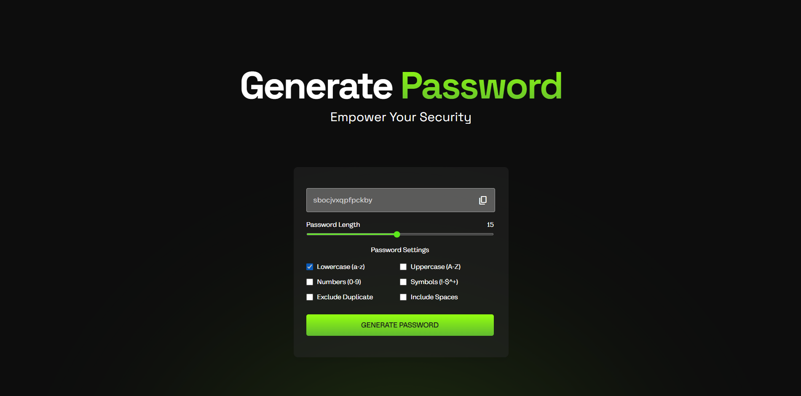

# Password Generator Website

## Description
The Password Generator Website is built using HTML, CSS, and JavaScript. It allows users to generate secure random passwords with customizable settings to enhance online security.

## Features
- Password length customization
- Options to include lowercase, uppercase, numbers, symbols, exclude duplicates, and include spaces
- Real-time password generation
- Copy password to clipboard functionality
- Smooth scrolling navigation

## Support
For support or inquiries, please contact me via:
- Email: inquery.saurav@gmail.com
- LinkedIn: [Saurav Chaturvedi](https://www.linkedin.com/in/isaurav/)

## Preview

